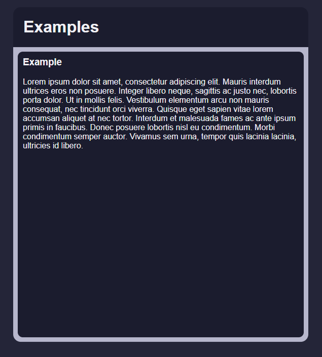
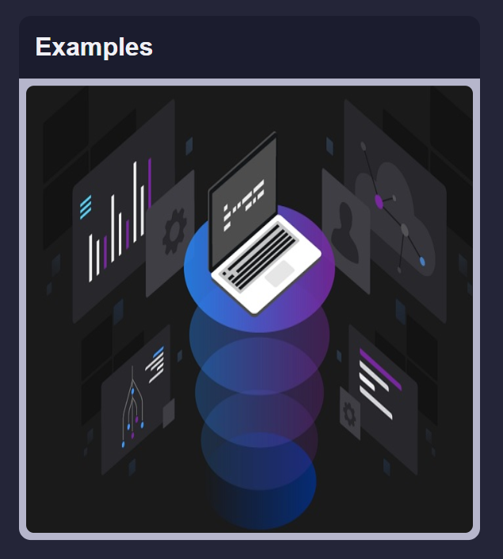
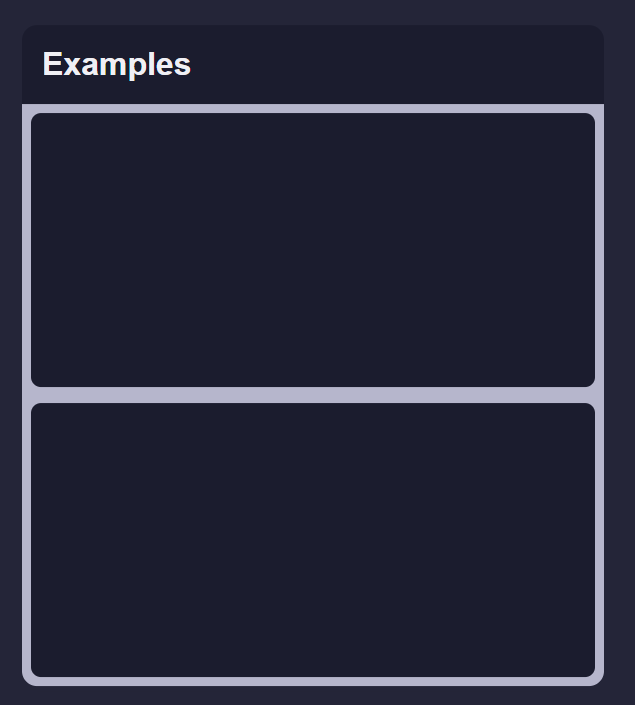
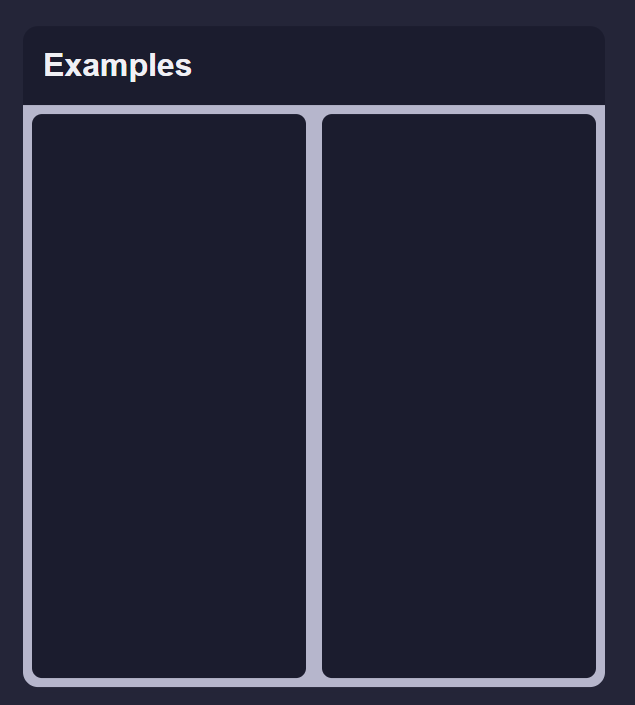
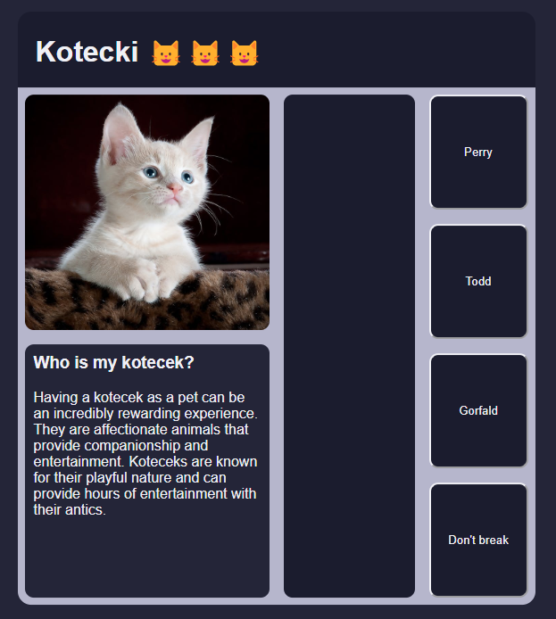

# recruitment-task-2023

## How to run:

in base directory run following commands:
- npm install
- npm start

in second terminal window, in resources directory run following command:
json-server --watch example.json --p 8080

## Important!
Due to json-server requirements, I've made a modification to the example.json file itself. I've nested its content inside '"definition": {}'.
I've also modified one property in model file:
referenceElementKey in Action, as word "Key" used to be lowerCase.

## Outcome
Provided solution when run will render:


## Goal

Prepare react application that will render **any** interactive card layout based on provided json definition that consists of known elements types(described below). By default, the element takes all available space. This space can be managed with dedicated elements(splitters). Every element has its own unique `elementKey`.

You can start with [StackBlitz ⚡️ template](https://stackblitz.com/edit/template-dt-ts)

### Resources: 
- All elements types can be found in `model.ts` file.
- in `example.json` there is a definition of example card that uses all features that needs to be implemented. 


## Elements

You have 5 elements type to implement:
* `TextTile` - Displays the text.
    - title - describes tile header
    - text - main text of the tile - text volume should not affect tile size
    - color - background color theme of the tile - you can assign any colors to theme here



- `ImageTile` - Displays an image.
    - source - URL pointing to image
    - title - alternative text/title



- `ButtonTile` - Hosts a button that performs an action on click.
    - text - button label
    - action - Executable action. Payload(value) depends on the action type.
    
    Action - when button is clicked, assigned action is triggered. In this example there is only one type of action to implement - `update`. When triggered, update action changes values that are specified in `value` object, in element that is referenced by `elementKey` in `referenceElementKey` field. e.g.

    ```
    "action": {
        "type": "update",
        "referenceElementKey": "09e76596-d48b-11ed-afa1-0242ac120002",
        "value": {
            "color": "light"
        }
    }
    ```
    will change `color` on tile with `elementKey` of `09e76596-d48b-11ed-afa1-0242ac120002`
    


- `HorizontalSplitter` - Splits available space horizontally `evenly` across all child elements.
    -  elements - list of children elements that will be displayed one after(below) another in order of occurrence
    


- `VerticalSplitter` - Splits available space vertically `evenly` across all child elements.
    -  elements - list of children elements that will be displayed next to each other in order of occurrence




## Requirements:  

- Fork this template and share your solution on github
- insert comments describing what you do if not obvious
- use Type Script (model can be found in `model.ts` file)
- use functional React components
- Project does not need to be "pixel perfect". Proper tree rendering and cross elements dependencies should be your first priority.
- assume that card definition(`Layout` object) is provided from `http://localhost:8080/definition` - you can use https://www.npmjs.com/package/json-server to serve example
- assume any reasonable limits you would need
- example card (definition in example.json) needs to be rendered and working properly


